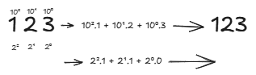
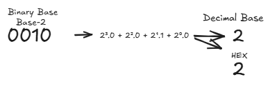
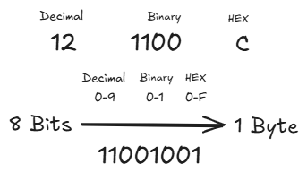
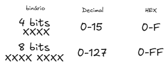

# Bit And Byte

A bit is the smallest unit of digital information, representing a single binary value of either 0 or 1. A byte, on the other hand, is a larger unit of digital information, typically consisting of eight bits.

## ASCII

Stands for American Standard Code for Information Interchange. It is a 7-bit character code where each individual bit represents a unique character. The page shows the extended ASCII table which is based on the Windows-1252 character set which is an 8 bit ASCII table with 256 characters and symbols.

## Unicode

An international encoding standard for use with different languages and scripts, by which each letter, digit, or symbol is assigned a unique numeric value that applies across different platforms and programs.

| type | representation |
|:----:|:--------------:|
| Binary | 11110000100111111001100010000010 |
| Hex | F09F9882 |
| Decimal | 4036991106 |
|unicode | 😂 |