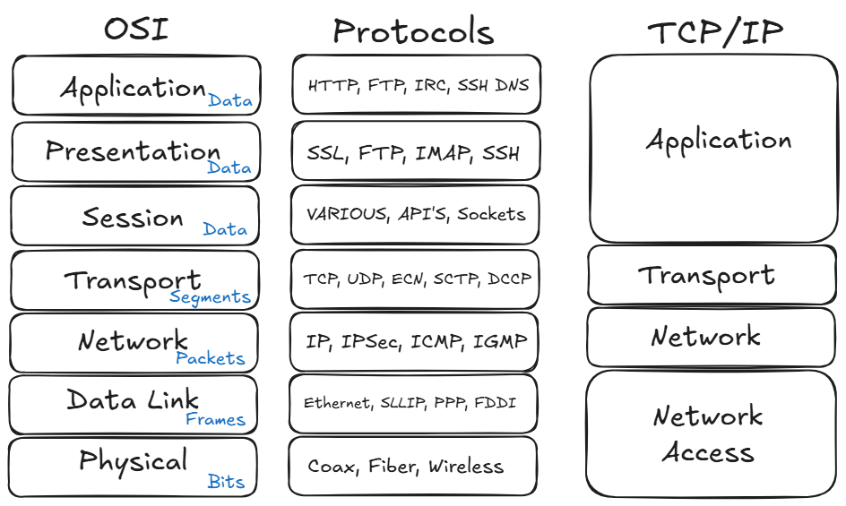

# Internet Basics




**traceroute**

```sh
enomoto@ubuntu:~$ traceroute google.com
traceroute to google.com (172.217.29.238), 30 hops max, 60 byte packets
 1  _gateway (192.168.18.1)  0.428 ms  0.645 ms  0.771 ms
 2  * * *
 3  200.150.94.98 (200.150.94.98)  5.571 ms  5.638 ms  5.688 ms
 4  72.14.222.152 (72.14.222.152)  7.809 ms  8.269 ms  8.342 ms
 5  192.178.84.37 (192.178.84.37)  10.321 ms  9.615 ms 142.251.64.27 (142.251.64.27)  9.712 ms
 6  192.178.110.179 (192.178.110.179)  9.622 ms 192.178.110.177 (192.178.110.177)  7.499 ms 192.178.110.179 (192.178.110.179)  7.501 ms
```

**whois**

```sh
enomoto@ubuntu:~$ whois 200.150.94.98
% IP Client: 2001:1284:f508:59bd:3e7c:3fff:fe7b:8c9a
 % Copyright (c) Nic.br - Use of this data is governed by the Use and
% Privacy Policy at https://registro.br/upp . Distribution,
% commercialization, reproduction, and use for advertising or similar
% purposes are expressly prohibited.
% 2025-07-14T13:09:07-03:00 - 2001:1284:f508:59bd:3e7c:3fff:fe7b:8c9a

inetnum:     200.150.94.0/24
aut-num:     AS14868
abuse-c:     ADLTE17
owner:       Ligga Telecomunica��es S.A.
ownerid:     04.368.865/0001-66
responsible: Engenharia de Telecom
country:     BR
owner-c:     ADLIG4
tech-c:      ADLTE17
created:     20080218
changed:     20240404
inetnum-up:  200.150.64.0/19

nic-hdl-br:  ADLIG4
person:      Administrador LIGGA
e-mail:      bgp@liggavc.com.br
country:     BR
created:     20240322
changed:     20240322

nic-hdl-br:  ADLTE17
person:      Administrador de Dominios Ligga Telecom
e-mail:      registro.ip.operacoes@liggavc.com.br
country:     BR
created:     20240404
changed:     20240404

% Security and mail abuse issues should also be addressed to cert.br,
% respectivelly to cert@cert.br and mail-abuse@cert.br
%
% whois.registro.br only accepts exact match queries for domains,
% registrants, contacts, tickets, providers, IPs, and ASNs.

```

## [OSI Model](https://docs.snowme34.com/en/latest/reference/network/osi-model.html)

* [Physical](https://docs.snowme34.com/en/latest/reference/network/osi-model.html#physical-layer)
* [Data Link](https://docs.snowme34.com/en/latest/reference/network/osi-model.html#data-link-layer)
* [Network](https://docs.snowme34.com/en/latest/reference/network/osi-model.html#network-layer)
* [Transport](https://docs.snowme34.com/en/latest/reference/network/osi-model.html#transport-layer)
* [Session](https://docs.snowme34.com/en/latest/reference/network/osi-model.html#session-layer)
* [Presentation](https://docs.snowme34.com/en/latest/reference/network/osi-model.html#presentation-layer)
* [Application](https://docs.snowme34.com/en/latest/reference/network/osi-model.html#application)

Deeply tied to HTTP, TCP/IP, and client-server communication. Covers the practical implementation of web-based APIs (REST, GraphQL, gRPC). Includes CORS, rate limiting, authentication (OAuth, JWT), etc.

Understanding API security is critical: tokens, encryption, rate limiting, OAuth2, API gateways, etc. Relevant for preventing attacks like injection, replay, and man-in-the-middle.

Load balancing is a way to spread work evenly across multiple servers so that no single server gets overwhelmed. Load balancing is a key concept in the area of Distributed Systems and is also highly relevant in the fields of:
* Networking
* Cloud Computing
* Web Infrastructure / DevOps
* Systems Architecture
* High Availability (HA) and Scalability Design

A protocol is a set of rules that define how data is transmitted and understood over a network — like grammar rules for computers talking to each other.

When data is sent over the internet, it's split into packets. Each packet has an IP header at the front, like an envelope label with delivery instructions.

DNS translates human-friendly domain names (like example.com) into IP addresses (like 93.184.216.34), which computers use to locate each other on a network.

[Protocols](https://github.com/matheusenomoto/software_engineering/blob/main/Internet/protocols.md)
[IP Header](https://github.com/matheusenomoto/software_engineering/blob/main/Internet/ip_header.md)
[DNS](https://github.com/matheusenomoto/software_engineering/blob/main/Internet/dns.md)