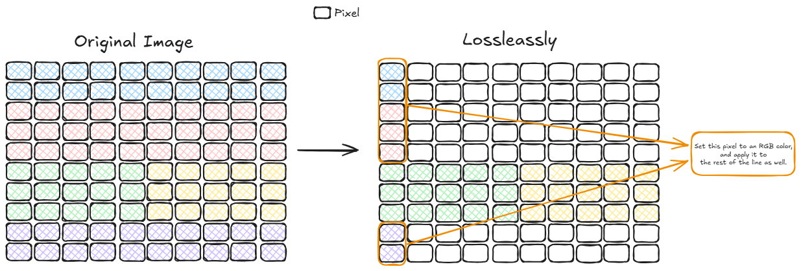

# Multimedia Basic

# RGB - Red Green Blue

## Compression

**Lossleassly**

class of data compression that allows the original data to be perfectly reconstructed from the compressed data.

**Lossily**

In information technology, lossy compression or irreversible compression is the class of data compression methods that uses inexact approximations and partial data discarding to represent the content.

**Interframe**

 instead of directly encoding the raw pixel values for each block, the encoder will try to find a block similar to the one it is encoding on a previously encoded frame, referred to as a reference frame.

 **Intraframe**

 Intraframe compression encodes each frame independently, like taking individual snapshots.

 **Codec**

 A technology that compresses and decompresses digital video files, enabling efficient storage, transmission, and playback. It's a combination of "coder" and "decoder," and essentially acts as a translator for video data. 