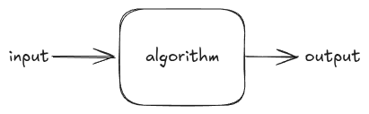

# Data Structures and Algorithms

## Reference
**Hands-On Data Structures and Algorithms with Python - Basant Agarwal**

## Table of Contents
1. [Data Types and Data Structures](#data-types-and-data-structures)
2. [Introduction to Algorithm Design](#introduction-to-algorithm-design)
3. [Algorithm Design Techniques and Strategies](#algorithm-design-techniques-and-strategies)
4. [Linked Lists](#linked-lists)
5. [Stacks and Queues](#stacks-and-queues)
6. [Trees](#trees)
7. [Heaps and Priority Queues](#heaps-and-priority-queues)
8. [Hash Tables](#hash-tables)
9. [Graphs and Algorithms](#graphs-and-algorithms)
10. [Search](#search)
11. [Sorting](#sorting)
12. [Selection Algorithms](#selection-algorithms)
13. [String Search Algorithms](#string-search-algorithms)

### Data Types and Data Structures

**Basic data types**

The most basic data types are numerical and boolean.

**Numerical**

Store numerical values. the whole values, floating point and complexes belong to this type of data.

- **integer (int)**: The interpreter considers a decimal digit sequence as a decimal value, such as integers 43, 10000, or -26
- **float**: Considers a number that has a floating point value as a float type; It is specified with a point
- **complex**: It is represented with the use of floating point values. It contains an orderly pair, a + Ib. Here, A and B represent real numbers and I represents the imaginary component.

**Boolean**

This type provides a true or false value and checks if any instruction is true or false.

```sh
True != False
```
**Sequence**

They are used to store multiple values in the same variable in an organized and efficient way. There are four basic types of sequence: string, range, lists and tuplas.

- **strings**: It is a sequence of immutable characters represented with quotes that can be simple, double, or triple.
```python
str_1 = 'hello world'
```
- **range**: It is a sequence of unchanging numbers. It is mainly used in loops for and while.
```python
range(start, stop, step)
```
- **lists**: Python lists are used to store multiple items in the same variable.
```python
list_1 = [7,'south', 9, 'west', 13, 'Europe']
```
- **tuples**: Tuples are used to store multiple items in the same variable. It is a reading collection only in which data is ordered (zero base indexation) and unchanged/unchanging.
```python
tuple_1 = (7,'south', 9, 'west', 13, 'Europe')
```

**Complex data types**
- **dictionaries**: A python dictionary is one of the important types of data, which is similar to a list, in the sense that it is also a collection of objects. It stores the data in pairs {key, value}. O The key should be a type of unchanging data and hashable and i vakir oide be any arbitrary python object.
```python
dict_1 = {
    <key>: <value>,
    <key>: <value>,
    ...
    ...
    ...
    <key>: <value>
}
```
- **sets**: A set in Python is a hashable collection of objects. It is iterable, mutable, and has unique elements. The order of the elements is also undefined. While adding and removing items is permitted, the items
themselves exist within the set and must be immutable and hashable.
```python
set_1 = {'algorithm', 'structure', 'data'}
```
- **frozenset**: It is an internal data structure, which is in every respect exactly like a set, except that it is immutable.
```python
frozen_set_1 = frozenset(['algorithm', 'structure', 'data'])
```

**Python collections module**

The collections module provides several types of containers, which are objects used to store different objects and provide a way for us to access them.

- **namedtuple**: Creates a tuple with named fields like regular tuples.
- **deque**: A doubly linked list that provides efficient insertion and removal of items at both ends of the list.
- **defaultdict**: A dictionary subclass that returns default values for missing keys.
- **Chain Map**: A dictionary that merges several dictionaries.
- **Counter**: A dictionary that returns the counts corresponding to its objects/keys.
- **UserDict UserList UserString**: These data types are used to add more functionality to your base data structure, such as dictionary, list, and string. We can subclass them to obtain a custom dict/list/string.


### Introduction to Algorithm Design

**Introduction to Algorithms**

An algorithm is a sequence of steps that must be followed to complete a specific task/question.



**Analysis of the unfolding of an algorithm**

Generally, the time performance of the algorithm is measured by the size of your input data, N, and the time and memory space used by it.

**Time complexity**

The time complexity of the algorithm is how long it takes to run on a computer system to produce output. The purpose of analyzing the time complexity of the algorithm is to determine, for a specific problem and more than one algorithm, which of the algorithms is most efficient in relation to the time required for its execution. The execution time of the algorithm is the sum of the time required by all instructions.

```python
def linear_search(arr, key):
    for i in range(len(arr)):
        if arr[i] == key:
            return i
    return -1
```

**Asymptotic notation**

When analyzing the time complexity of an algorithm, the growth rate (order of growth) is very important when the input size is large. When the input size becomes large, we only consider the higher-order terms and ignore irrelevant terms.

- **Big-Theta(Θ) notation**: Represents the worst-case runtime complexity with a tight bound.
- **Big-O(O) notation**: Represents the worst-case runtime complexity with an upper bound, which ensures that the function never grows faster than the upper bound.
- **Big-Omega(Ω) notation**: Represents the lower bound on an algorithm's execution time. It measures the best time for the algorithm to execute.

**Theta notation**

$T(n) = \Theta(F(n))$

**Big-O notation**

$T(n) = O(F(n))$

**Omega notation**

$T(n) = \Omega(F(n))$

### Algorithm Design Techniques and Strategies

**Algorithm Design Techniques**

It is a powerful tool for visualizing and clearly understanding precisely formulated real-world problems. Brute-force approaches test all possible solution combinations to solve a problem. This approach can provide useful solutions for limited input sizes, but becomes very inefficient as the input size increases. Design technique guidelines also help to easily develop new algorithms for complex problems. There are several algorithm design paradigms.

**Recursion**

Calls itself repeatedly to solve the problem until a specific condition is met. Each recursive call generates another recursive call.

* **Base Case**
    * They tell the recursion when it should end, meaning that the recursion will stop when the base condition is met.
* **Recursive Case**
    * The function calls itself recursively and so we move towards the base criteria.


**Divide and Conquer**

The divide-and-conquer paradigm divides a problem into smaller subproblems and solves them; finally, it combines the results to obtain a globally optimal solution. In divide-and-conquer design, the problem is divided into two smaller subproblems, with each subproblem solved recursively.

* Binary search
* Merge sort
* Quick sort
* Fast multiplication algorithm
* Strassen matrix multiplication
* Closest pair of points

* **binary search**
    * First, it compares the search element with the middle element of the list. If the search element is smaller than the middle element, the half of the list with elements larger than the middle element is discarded. The process is repeated recursively. With each iteration, half of the search space is discarded.


* **merge sort**
    * Concept: Divide the list into halves recursively, sort each half, and merge them back together in sorted order.
    * Time Complexity: O(n log n) in all cases
    * Stability: Stable
    * Use Case: Great for large datasets and linked lists.

**Dynamic Programming**

It's the most powerful design technique for solving optimization problems. These problems typically have many possible solutions. It's based on the intuition of the divide-and-conquer technique. Dynamic programming problems have two important characteristics.

* **optimal substructure**
    * Given a problem, if the solution can be obtained by combining the solutions of its subproblems, the problem is said to have an optimal substructure. For example, the i-th Fibonacci number in its seriescan be calculated from the i-th -1 and the i-th -2.
* **overlapping subproblems**
    * When an algorithm needs to repeatedly solve the same subproblem, this happens because the problem has overlapping subproblems.

**Greedy Algorithms**

They involve optimization and combinatorial problems. The goal is to obtain the optimal solution from many possible solutions at each stage. The goal is to obtain the local optimal solution, which may ultimately lead to the global optimal solution.

* **shortest path**
    * The shortest path problem requires us to find the shortest possible route between nodes in a graph. Dijkstra's algorithm is a very popular method for solving this problem using the greedy approach.


* **Dijkstra Algorithm**
    * It is used in Internet routing protocols, primarily in link-state protocols. The main protocols that use this algorithm are:
    * **OSPF (Open Shortest Path First)**
        * Category: Internal Routing Protocol (IGP).
        * Dijkstra's Usage: Each router calculates the shortest path tree to all other routers in the network based on link state information.
        * Resulting tree: SPF (Shortest Path First) tree.
        * Function: Determine the best route to each destination in the AS (Autonomous System). 
    * **IS-IS (Intermediate System to Intermediate System)**
        * Category: Interior Routing Protocol (IGP), widely used in provider networks.
        * Use of Dijkstra: Also uses a variation of the SPF algorithm to calculate the best routes based on a link-state database.
        * Similarity to OSPF: Both are link-state protocols and share similar operating principles.
* **Bellman-Ford**
    * Find the shortest path from a single source to all vertices, and it handles negative weights. Also detects negative weight cycles.

```python
# Define a weighted graph using an adjacency list (dictionary of dictionaries)
graph = dict()
graph['A'] = {'B': 5, 'D': 9, 'E': 2}
graph['B'] = {'A': 5, 'C': 2}
graph['C'] = {'B': 2, 'D': 3}
graph['D'] = {'A': 9, 'F': 2, 'C': 3}
graph['E'] = {'A': 2, 'F': 3}
graph['F'] = {'E': 3, 'D': 2}

# Initialize the shortest path table:
# Each node maps to a list: [shortest_distance_from_origin, previous_node_in_path]
table = {
    'A': [0, None],               # Distance from A to A is 0
    'B': [float('inf'), None],   # Unknown distances are set to infinity
    'C': [float('inf'), None],
    'D': [float('inf'), None],
    'E': [float('inf'), None],
    'F': [float('inf'), None]
}

# Constants for easier index access
DISTANCE = 0
PREVIOUS_NODE = 1
INFINITY = float('inf')

# Get the current shortest known distance to a given vertex
def get_shortest_distance(table, vertex):
    shortest_distance = table[vertex][DISTANCE]
    return shortest_distance

# Update the shortest distance to a vertex
def set_shortest_distance(table, vertex, new_distance):
    table[vertex][DISTANCE] = new_distance

# Set the previous node for a given vertex (used for path reconstruction)
def set_previous_node(table, vertex, previous_node):
    table[vertex][PREVIOUS_NODE] = previous_node

# Get the edge weight between two connected vertices
def get_distance(graph, first_vertex, second_vertex):
    return graph[first_vertex][second_vertex]

# Get the next unvisited node with the smallest known distance
def get_next_node(table, visited_nodes):
    # All unvisited nodes
    unvisited_nodes = list(set(table.keys()).difference(set(visited_nodes)))
    # Start with first unvisited node as the min
    assumed_min = table[unvisited_nodes[0]][DISTANCE]
    min_vertex = unvisited_nodes[0]
    
    # Find the unvisited node with the smallest distance
    for node in unvisited_nodes:
        if table[node][DISTANCE] < assumed_min:
            assumed_min = table[node][DISTANCE]
            min_vertex = node
    
    return min_vertex

# Main function to compute the shortest paths from origin to all other nodes
def find_shortest_path(graph, table, origin):
    visited_nodes = []          # Keep track of processed nodes
    current_node = origin       # Start at the origin
    starting_node = origin

    while True:
        adjacent_nodes = graph[current_node]
        
        # If all adjacent nodes are visited, move on
        if set(adjacent_nodes).issubset(set(visited_nodes)):
            pass
        else:
            # Get only the adjacent nodes not yet visited
            unvisited_nodes = set(adjacent_nodes).difference(set(visited_nodes))
            for vertex in unvisited_nodes:
                distance_from_starting_node = get_shortest_distance(table, vertex)
                
                # Special case: if we're at the starting node and this vertex is being visited for the first time
                if distance_from_starting_node == INFINITY and current_node == starting_node:
                    total_distance = get_distance(graph, vertex, current_node)
                else:
                    # General case: calculate distance through the current node
                    total_distance = get_shortest_distance(table, current_node) + get_distance(graph, current_node, vertex)
                
                # If the newly calculated path is shorter, update it
                if total_distance < distance_from_starting_node:
                    set_shortest_distance(table, vertex, total_distance)
                    set_previous_node(table, vertex, current_node)
            
            # Mark current node as visited
            visited_nodes.append(current_node)
            print(visited_nodes)  # Debug print to track progress

            # Stop if all nodes have been visited
            if len(visited_nodes) == len(table.keys()):
                break

            # Pick the next node to process
            current_node = get_next_node(table, visited_nodes)

    return table  # Final shortest path table

# Run the algorithm from node 'A'
shortest_path_table = find_shortest_path(graph, table, 'A')

```

### Linked Lists

**linked lists**

It is a data structure in which data elements are stored in a linear order. They provide efficient storage in linear order through pointer-based structures. Pointers are used to store the memory addresses of data items.

**arrays**

It is a data structure in which data elements are stored in a linear order. They provide efficient storage in linear order through pointer-based structures. Pointers are used to store the memory addresses of data items. An array is a collection of data items of the same type, while a linked list is a collection of the same data types stored sequentially and connected by pointers. In lists, data elements are stored in different locations in memory, while in arrays, the elements are stored in contiguous locations in memory. The term base address refers to the address of the location in memory where the first element is stored, and offset refers to an integer that indicates the offset between the first element and a specific element.

**linked lists**


A node is an essential component of various data structures, such as linked lists. It is a data container and has one or more links that lead to other nodes, where a link is a pointer.

**singly linked lists**


```python
n1 = Node('eggs')
n1 = Node('ham')
n1 = Node('spam')

n1.next = n2
n2.next = n3

current = n1

while current:
    print(current.data)
    current = current.next

def iter(self):
    current = self.head
    while current:
        val = current.data
        current = current.next
        yield val

```

**append**

**head no tail**

```python
class Node:
    def __init__(self, data=None):
        self.data = data
        self.next = None

class SinglyLinkedList:
    '''
    iter all the linked list to append
    '''
    def __init__(self):
        self.head = None
        self.size = 0

    def append(self, data):
        node = Node(data)
        if self.head is None:
            self.head = node
        else:
            current = self.head
            while current.next:
                current = current.next
            current.next = node
```

**head & tail**

```python
class Node:
    def __init__(self, data=None):
        self.data = data
        self.next = None

class SinglyLinkedList:
    '''
    with head and tail
    '''
    def __init__(self):
        self.tail = None
        self.head = None
        self.size = 0

    def append(self, data):
        node = Node(data)
        if self.tail:
            self.tail.next = node
            self.tail = node
        else:
            self.head = node
            self.tail = node
```


**intermediate positions**

```python
class Node:
    def __init__(self, data=None):
        self.data = data
        self.next = None

class SinglyLinkedList:
    def __init__(self):
        self.tail = None
        self.head = None
        self.size = 0

    def append(self, data):
        node = Node(data)
        if self.tail:
            self.tail.next = node
            self.tail = node
        else:
            self.head = node
            self.tail = node
    
    def append_at_a_location(self, data, index):
        if index < 0:
            print("Invalid index")
            return

        node = Node(data)

        if index == 0:
            node.next = self.head
            self.head = node
            if self.tail is None:
                self.tail = node
            self.size += 1
            return

        current = self.head
        prev = None
        count = 0

        while current:
            if count == index:
                node.next = current
                if prev:
                    prev.next = node
                self.size += 1
                return
            prev = current
            current = current.next
            count += 1

        if count == index:
            if self.tail:
                self.tail.next = node
                self.tail = node
            else:
                self.head = self.tail = node
            self.size += 1
        else:
            print("The list has fewer elements than the index provided.")
```


**search**

```python
def iter(self):
        current = self.head
        while current:
            val = current.data
            current = current.next
            yield val
    
    def search(self, data):
        for node in self.iter():
            if data == node:
                return True
        return False
```

**size**

```python
def size(self):
        count = 0
        current = self.head
        while current:
            count += 1
            current = current.next
        return count
```

**delete**

```python
def delete_first_node(self):
        current = self.head
        if self.head is None:
            print('No data element to delete')
        elif current == self.head:
            self.head = current.next

def delete_last_node(self):
        current = self.head
        prev = self.head
        while current:
            if current.next is None:
                prev.next = current.next
                self.size -=1
            prev = current
            current = current.next

def delete(self, data):
        current = self.head
        prev = self.head
        while current:
            if current.data == data:
                if current == self.head:
                    self.head = current.next
                else:
                    prev.next = current.next
                self.size -= 1
                return
            prev = current
            current = current.next
```


**clear**

```python
def clear(self):
        self.tail = None
        self.head = None
```
**doubly linked list**

The only difference between the doubly linked list and the single linked list is that the doubly linked list also has a pointer pointing to the previous node.


```python
class Node:
    def __init__(self, data=None, next = None, prev = None):
        self.data = data
        self.next = next
        self.prev = prev

class DoublyLinkedList:
    def __init__(self):
        self.head = None
        self.tail = None
        self.count = 0
```
**append**

```python
    def append_at_start (self, data):
        new_node = Node(data, None, None)
        if self.head is None:
            self.head = new_node
            self.tail = self.head
        else:
            new_node.next = self.head
            self.head.prev = new_node
            self.head = new_node
        self.count += 1

    def append_at_start (self, data):
        new_node = Node(data, None, None)
        if self.head is None:
            self.head = new_node
            self.tail = self.head
        else:
            new_node.next = self.head
            self.head.prev = new_node
            self.head = new_node
        self.count += 1

    def append_at_a_location(self, data, position):
        current = self.head
        while current:
            if current.data == position:
                new_node = Node(data, current, current.prev)
                if current.prev:
                    current.prev.next = new_node
                else:
                    self.head = new_node
                current.prev = new_node
                self.count += 1
                break  # evita múltiplas inserções
            current = current.next
```


**search**

```python
def iter(self):
        current = self.head
        while current:
            val = current.data
            current = current.next
            yield val
    
    def contains(self, data):
        for node_data in self.iter():
            if data == node_data:
                print(f'Data ({node_data}) item is present in the list')
                return
        print(f'Data ({data}) item is not present in the list')
        return
```

**delete**

```python
def delete(self, data):
        current = self.head
        node_deleted = False
        if current is None:
            print("List is empty")
        elif current.data == data:
            # Data at the start
            self.head.prev = None
            node_deleted = True
            self.head = current.next
        elif self.tail.data == data:
            # Data at the end
            self.tail = self.tail.prev
            self.tail.next = None
            node_deleted = True
        else:
            while current:
                # search at intermediate positions
                if current.data == data:
                    current.prev.next = current.next
                    current.next.prev = current.prev
                    node_deleted = True
                current = current.next
            if node_deleted == False:
                print('Item not found')
        
        if node_deleted:
            self.count -=1
```

**circular linked lists**

A circular linked list is a variation of a regular linked list where the last node doesn't point to None - instead, it points back to the first node, forming a circle.

**singly circular linked list**

A circular linked list is a variation of a regular linked list where the last node doesn't point to None - instead, it points back to the first node, forming a circle.


```python
class Node:
    def __init__(self, data=None):
        self.data = data
        self.next = None

class SinglyCircularLinkedList:
    def __init__(self):
        self.tail = None
        self.head = None
        self.size = 0

    def append(self, data):
        node = Node(data)
        if self.tail:
            self.tail.next = node
            self.tail = node
            node.next = self.head
        else:
            self.head = node
            self.tail = node
            self.tail.next = self.head 
        self.size +=1

    
    def iter(self):
        if not self.head:
            return
        current = self.head
        while True:
            yield current.data
            current = current.next
            if current == self.head:
                break
    
    def delete(self, data):
        if not self.head:
            return

        current = self.head
        prev = self.tail

        while True:
            if current.data == data:
                if current == self.head:
                    self.head = current.next
                    self.tail.next = self.head
                    if current == self.tail:
                        # Only one node
                        self.head = self.tail = None
                elif current == self.tail:
                    prev.next = self.head
                    self.tail = prev
                else:
                    prev.next = current.next

                self.size -= 1
                return

            prev = current
            current = current.next

            if current == self.head:
                break  # We've looped once; data not found
```

**doubly circular linked list**

Each node has next and prev pointers, and the first and last nodes are connected in both directions.


**Applications**

Singly linked lists can be used to represent sparse matrices by storing only nonzero elements along with their indices. They are also useful for representing and manipulating polynomials, where each node stores a term (typically including a coefficient and exponent). Additionally, singly linked lists can serve as a foundation for dynamic memory management schemes, allowing memory to be allocated and deallocated during runtime.

Doubly linked lists are employed by operating systems—for example, in the thread scheduler—to maintain a list of currently active processes. They are also frequently used to implement MRU (Most Recently Used) and LRU (Least Recently Used) caches within the operating system.

Circular linked lists are ideal for implementing round-robin scheduling mechanisms in operating systems. They can also be used to facilitate features such as software undo functionality and to maintain browser histories, enabling features like the back button.

### Stacks and Queues

**Stacks**

Stacks are a data structure that stores data in a specific order, similar to arrays and linked lists, but with additional restrictions.
* Data elements can only be inserted at the top of the stack (push operation).
* Data elements can only be deleted from the top of the stack (pop operation).
* Only the last data element can be read from the top of stack (peek operation).

A stack is a LIFO (last in, first out) structure


**Stack using linked lists**

```python
class Node:
    def __init__(self, data=None):
        self.data = data
        self.next = None

class Stack:
    def __init__(self, data=None):
        self.top = None
        self.size = 0
    
    def push(self, data):
        # New node
        node = Node(data)
        if self.top:
            node.next = self.top
            self.top = node
        else:
            self.top = node
        self.size += 1

    def pop(self):
        if self.top:
            data = self.top.data
            self.size -= 1
            if self.top.next:
                self.top = self.top.next
            else:
                self.top = None
            return data
        else:
            print('Stack is empty')
    
    def peek(self):
        if self.top:
            return self.top.data
        else:
            print('Stack is empty')
```


**Application**

It's used in expression evaluation and conversion (e.g., infix to postfix), syntax parsing (e.g., matching parentheses or HTML tags), and managing function calls through the call stack. Stacks support undo/redo functionality in text editors, enable backtracking in algorithms like maze solving or Sudoku, and handle navigation history in browsers. They are also essential in depth-first search (DFS), memory management (stack frames for local variables), and are used in virtual machines like the JVM for executing bytecode.

**Queues**

A queue is a list of elements stored in sequence, with the following restrictions:

* Elements can only be inserted at one end - the back (or tail) of the queue.
* Elements can only be removed from the opposite end - the front (or head) of the queue.
* Only the element at the front of the queue can be read (peek operation)."

A queue is a FIFO (first in, first out) structure


**Queues using lists of python**

```python
class ListQueue:
    def __init__(self):
        self.items = []
        self.front = self.rear = 0
        self.size = 3 # maximum queue size

    def enqueue(self, data):
        if self.size == self.rear:
            print('\n Queue is full')
        else:
            self.items.append(data)
            self.rear += 1 
    def dequeue(self):
        if self.front == self.rear:
            print('\n Queue is empty')
        else:
            data = self.items.pop(0)
            self.rear -= 1
            return data

def test_list_queue():
    q = ListQueue()

    # Test enqueue until full
    q.enqueue(10)
    q.enqueue(20)
    q.enqueue(30)
    print("Queue after 3 enqueues:", q.items)  # Expected: [10, 20, 30]

    # Try enqueueing when full
    q.enqueue(40)  # Expected: "Queue is full"

    # Test dequeue
    print("Dequeued:", q.dequeue())  # Expected: 10
    print("Queue after one dequeue:", q.items)  # Expected: [20, 30]

    # Dequeue remaining elements
    q.dequeue()
    q.dequeue()

    # Try dequeueing when empty
    q.dequeue()  # Expected: "Queue is empty"

test_list_queue()
```

```sh
Queue after 3 enqueues: [10, 20, 30]

 Queue is full
Dequeued: 10
Queue after one dequeue: [20, 30]

 Queue is empty
```

**Queues using linked lists**

```python
class Node(object):
    def __init__(self, data=None, next=None, prev=None):
        self.data = data
        self.next = next
        self.prev = prev
    

class LinkedListQueue:
    def __init__(self):
        self.head = None
        self.tail = None
        self.count = 0

    def enqueue(self, data):
        new_node = Node(data, None, None)
        if self.head == None:
            self.head = new_node
            self.tail = self.head
        else:
            new_node.prev = self.tail
            self.tail.next = new_node
            self.tail = new_node
        
        self.count += 1
 
    def dequeue(self):
        if self.count == 0:
            print('Queue is empty.')
            return

        if self.count == 1:
            self.head = None
            self.tail = None
        else:
            self.head = self.head.next
            self.head.prev = None

        self.count -= 1

def test_linked_list_queue():
    q = LinkedListQueue()

    # Enqueue elements
    q.enqueue(10)
    q.enqueue(20)
    q.enqueue(30)

    # Traverse and print queue
    current = q.head
    result = []
    while current:
        result.append(current.data)
        current = current.next
    print("Queue after 3 enqueues:", result)  # Expected: [10, 20, 30]

    # Dequeue 1 element
    q.dequeue()
    current = q.head
    result = []
    while current:
        result.append(current.data)
        current = current.next
    print("Queue after 1 dequeue:", result)  # Expected: [20, 30]

    # Dequeue 2 more to empty it
    q.dequeue()
    q.dequeue()

    # Try dequeue on empty queue
    q.dequeue()  # Expected: 'Queue is empty.'

test_linked_list_queue()
```

```sh
Queue after 3 enqueues: [10, 20, 30]
Queue after 1 dequeue: [20, 30]
Queue is empty.
```

**Application**

It can be used to queue individual printouts arriving from each computer on a network to a printer. Operating systems can queue processes to be executed by the CPU. 


### Trees

### Heaps and Priority Queues

### Hash Tables

### Graphs and Algorithms

### Search

### Sorting

### Selection Algorithms

### String Search Algorithms
