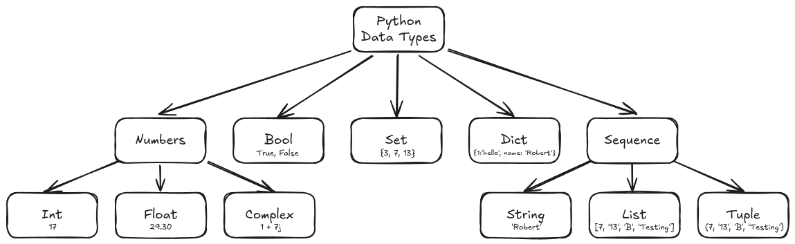

# Data Structures and Algorithms

## Reference
**Hands-On Data Structures and Algorithms with Python - Basant Agarwal**

## Table of Contents
1. [Data Types and Data Structures](#data-types-and-data-structures)
2. [Introduction to Algorithm Design](#introduction-to-algorithm-design)
3. [Algorithm Design Techniques and Strategies](#algorithm-design-techniques-and-strategies)
4. [Linked Lists](#linked-lists)
5. [Stacks and Queues](#stacks-and-queues)
6. [Trees](#trees)
7. [Heaps and Priority Queues](#heaps-and-priority-queues)
8. [Hash Tables](#hash-tables)
9. [Graphs and Algorithms](#graphs-and-algorithms)
10. [Search](#search)
11. [Sorting](#sorting)
12. [Selection Algorithms](#selection-algorithms)
13. [String Search Algorithms](#string-search-algorithms)

### Data Types and Data Structures

**Basic data types**

The most basic data types are numerical and boolean.

**Numerical**

Store numerical values. the whole values, floating point and complexes belong to this type of data.

- **integer (int)**: The interpreter considers a decimal digit sequence as a decimal value, such as integers 43, 10000, or -26
- **float**: Considers a number that has a floating point value as a float type; It is specified with a point
- **complex**: It is represented with the use of floating point values. It contains an orderly pair, a + Ib. Here, A and B represent real numbers and I represents the imaginary component.

**Boolean**

This type provides a true or false value and checks if any instruction is true or false.

```sh
True != False
```
**Sequence**

They are used to store multiple values in the same variable in an organized and efficient way. There are four basic types of sequence: string, range, lists and tuplas.

- **strings**: It is a sequence of immutable characters represented with quotes that can be simple, double, or triple.
```python
str_1 = 'hello world'
```
- **range**: It is a sequence of unchanging numbers. It is mainly used in loops for and while.
```python
range(start, stop, step)
```
- **lists**: Python lists are used to store multiple items in the same variable.
```python
list_1 = [7,'south', 9, 'west', 13, 'Europe']
```
- **tuples**: Tuples are used to store multiple items in the same variable. It is a reading collection only in which data is ordered (zero base indexation) and unchanged/unchanging.
```python
tuple_1 = (7,'south', 9, 'west', 13, 'Europe')
```

**Complex data types**
- **dictionaries**: A python dictionary is one of the important types of data, which is similar to a list, in the sense that it is also a collection of objects. It stores the data in pairs {key, value}. O The key should be a type of unchanging data and hashable and i vakir oide be any arbitrary python object.
```python
dict_1 = {
    <key>: <value>,
    <key>: <value>,
    ...
    ...
    ...
    <key>: <value>
}
```
- **sets**: A set in Python is a hashable collection of objects. It is iterable, mutable, and has unique elements. The order of the elements is also undefined. While adding and removing items is permitted, the items
themselves exist within the set and must be immutable and hashable.
```python
set_1 = {'algorithm', 'structure', 'data'}
```
- **frozenset**: It is an internal data structure, which is in every respect exactly like a set, except that it is immutable.
```python
frozen_set_1 = frozenset(['algorithm', 'structure', 'data'])
```

**Python collections module**

The collections module provides several types of containers, which are objects used to store different objects and provide a way for us to access them.

- **namedtuple**: Creates a tuple with named fields like regular tuples.
- **deque**: A doubly linked list that provides efficient insertion and removal of items at both ends of the list.
- **defaultdict**: A dictionary subclass that returns default values for missing keys.
- **Chain Map**: A dictionary that merges several dictionaries.
- **Counter**: A dictionary that returns the counts corresponding to its objects/keys.
- **UserDict UserList UserString**: These data types are used to add more functionality to your base data structure, such as dictionary, list, and string. We can subclass them to obtain a custom dict/list/string.



### Introduction to Algorithm Design

**Introduction to Algorithms**

An algorithm is a sequence of steps that must be followed to complete a specific task/question.


**Analysis of the unfolding of an algorithm**

Generally, the time performance of the algorithm is measured by the size of your input data, N, and the time and memory space used by it.

**Time complexity**

The time complexity of the algorithm is how long it takes to run on a computer system to produce output. The purpose of analyzing the time complexity of the algorithm is to determine, for a specific problem and more than one algorithm, which of the algorithms is most efficient in relation to the time required for its execution. The execution time of the algorithm is the sum of the time required by all instructions.

```python
def linear_search(arr, key):
    for i in range(len(arr)):
        if arr[i] == key:
            return i
    return -1
```

**Asymptotic notation**

When analyzing the time complexity of an algorithm, the growth rate (order of growth) is very important when the input size is large. When the input size becomes large, we only consider the higher-order terms and ignore irrelevant terms.

- **Big-Theta(Θ) notation**: Represents the worst-case runtime complexity with a tight bound.
- **Big-O(O) notation**: Represents the worst-case runtime complexity with an upper bound, which ensures that the function never grows faster than the upper bound.
- **Big-Omega(Ω) notation**: Represents the lower bound on an algorithm's execution time. It measures the best time for the algorithm to execute.

**Theta notation**

$T(n) = \Theta(F(n))$

**Big-O notation**

$T(n) = O(F(n))$

**Omega notation**

$T(n) = \Omega(F(n))$

### Algorithm Design Techniques and Strategies

**Algorithm Design Techniques**

It is a powerful tool for visualizing and clearly understanding precisely formulated real-world problems. Brute-force approaches test all possible solution combinations to solve a problem. This approach can provide useful solutions for limited input sizes, but becomes very inefficient as the input size increases. Design technique guidelines also help to easily develop new algorithms for complex problems. There are several algorithm design paradigms.

**Recursion**

Calls itself repeatedly to solve the problem until a specific condition is met. Each recursive call generates another recursive call.

* **Base Case**
    * They tell the recursion when it should end, meaning that the recursion will stop when the base condition is met.
* **Recursive Case**
    * The function calls itself recursively and so we move towards the base criteria.


**Divide and Conquer**

The divide-and-conquer paradigm divides a problem into smaller subproblems and solves them; finally, it combines the results to obtain a globally optimal solution. In divide-and-conquer design, the problem is divided into two smaller subproblems, with each subproblem solved recursively.

* Binary search
* Merge sort
* Quick sort
* Fast multiplication algorithm
* Strassen matrix multiplication
* Closest pair of points

* **binary search**
    * First, it compares the search element with the middle element of the list. If the search element is smaller than the middle element, the half of the list with elements larger than the middle element is discarded. The process is repeated recursively. With each iteration, half of the search space is discarded.


* **merge sort**
    * Concept: Divide the list into halves recursively, sort each half, and merge them back together in sorted order.
    * Time Complexity: O(n log n) in all cases
    * Stability: Stable
    * Use Case: Great for large datasets and linked lists.

**Dynamic Programming**

It's the most powerful design technique for solving optimization problems. These problems typically have many possible solutions. It's based on the intuition of the divide-and-conquer technique. Dynamic programming problems have two important characteristics.

* **optimal substructure**
    * Given a problem, if the solution can be obtained by combining the solutions of its subproblems, the problem is said to have an optimal substructure. For example, the i-th Fibonacci number in its seriescan be calculated from the i-th -1 and the i-th -2.
* **overlapping subproblems**
    * When an algorithm needs to repeatedly solve the same subproblem, this happens because the problem has overlapping subproblems.

**Greedy Algorithms**

They involve optimization and combinatorial problems. The goal is to obtain the optimal solution from many possible solutions at each stage. The goal is to obtain the local optimal solution, which may ultimately lead to the global optimal solution.

* **shortest path**
    * The shortest path problem requires us to find the shortest possible route between nodes in a graph. Dijkstra's algorithm is a very popular method for solving this problem using the greedy approach.


* **Dijkstra Algorithm**
    * It is used in Internet routing protocols, primarily in link-state protocols. The main protocols that use this algorithm are:
    * **OSPF (Open Shortest Path First)**
        * Category: Internal Routing Protocol (IGP).
        * Dijkstra's Usage: Each router calculates the shortest path tree to all other routers in the network based on link state information.
        * Resulting tree: SPF (Shortest Path First) tree.
        * Function: Determine the best route to each destination in the AS (Autonomous System). 
    * **IS-IS (Intermediate System to Intermediate System)**
        * Category: Interior Routing Protocol (IGP), widely used in provider networks.
        * Use of Dijkstra: Also uses a variation of the SPF algorithm to calculate the best routes based on a link-state database.
        * Similarity to OSPF: Both are link-state protocols and share similar operating principles.
* **Bellman-Ford**
    * Find the shortest path from a single source to all vertices, and it handles negative weights. Also detects negative weight cycles.


### Linked Lists


### Stacks and Queues

### Trees

### Heaps and Priority Queues

### Hash Tables

### Graphs and Algorithms

### Search

### Sorting

### Selection Algorithms

### String Search Algorithms
