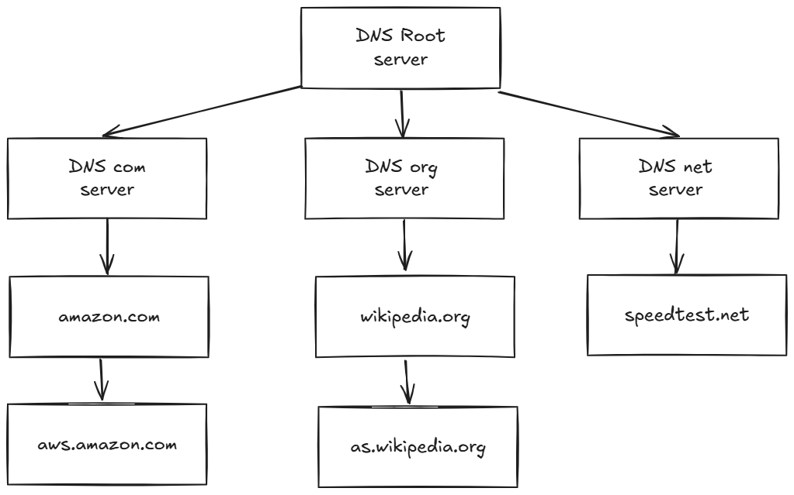
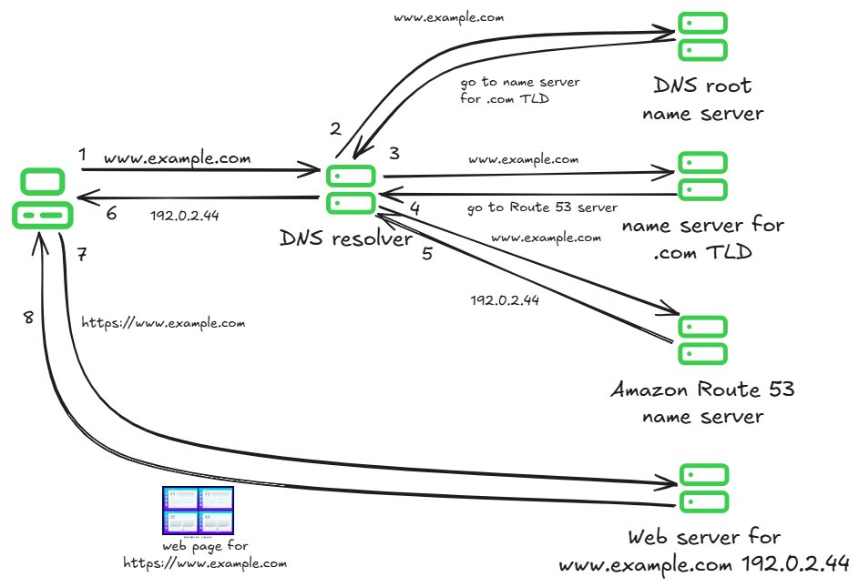
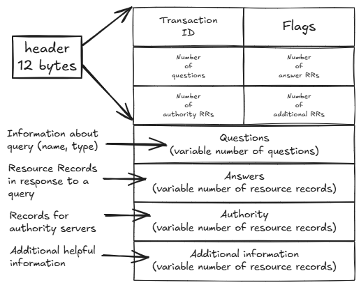

# Domain Name System - DNS 

DNS is a hierarchical and distributed system that translates human-friendly domain names (like example.com) into IP addresses (like 93.184.216.34), which computers use to locate each other on a network.

## DNS Root

The Root is the top of the DNS hierarchy. If you query www.example.com, the root server doesn't know the IP but says: "Ask the .com TLD servers."

## TLD (Top-Level Domain)

One level below the root. The TLD server responds with: "Ask the authoritative server for example.com."

## Authoritative Name Server

Stores the actual DNS records (A, AAAA, MX, TXT, etc.) for a domain. Authoritative server response: "www.example.com resolves to 93.184.216.34.

## DNS Record Types

| type | stands for | purpose |
|:----:|:----------:|:--------|
| A | Address | Maps a domain to an IPv4 address |
| AAAA | IPv6 Address | Maps a domain to an IPv6 address |
| CNAME | Canonical Name | Maps a domain to another domain name (alias) |
| NS | Name Server | Specifies the authoritative name servers for a zone |
| MX | Mail Exchange | Defines mail servers for a domain |
| TXT | Text | Stores arbitrary text (e.g., SPF, DKIM, verification) |
| SOA | Start of Authority | Contains administrative info about the zone |
| PTR | Pointer | Used for reverse DNS lookups |
| SRV | Service | Defines services like SIP or XMPP |
| CAA | Certification Auth. | Restricts which CAs can issue certs for a domain |

## DNS message format

