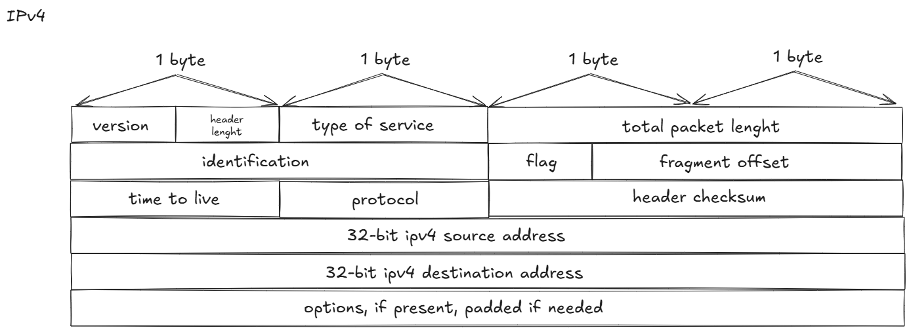
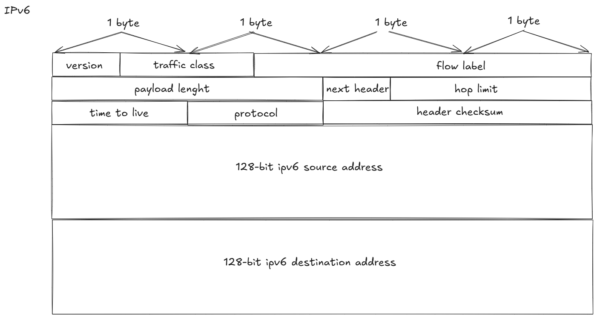

# IP Header

## PDU

PDU stands for Protocol Data Unit. It refers to a unit of data transmitted between network entities at a specific layer of a communication protocol stack, like the OSI model or TCP/IP model.

## Summary Table