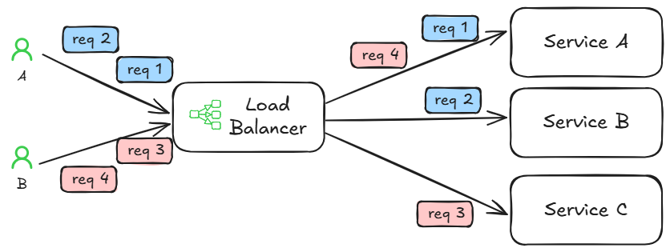
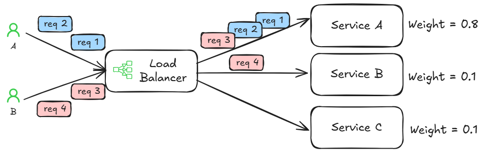
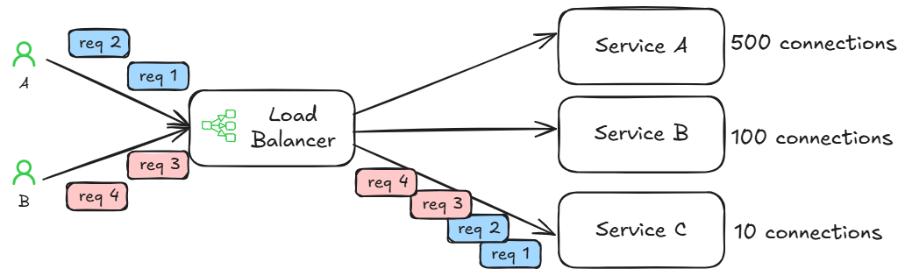
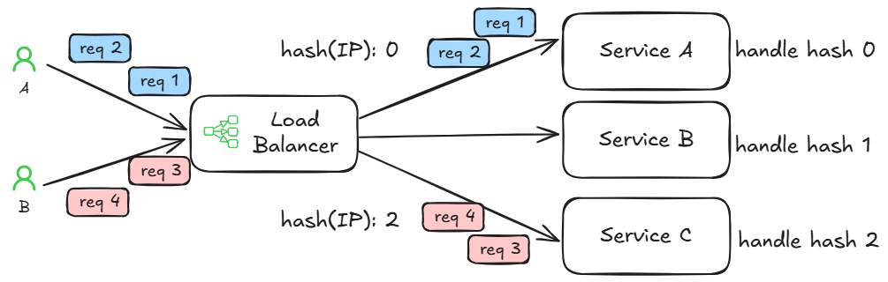
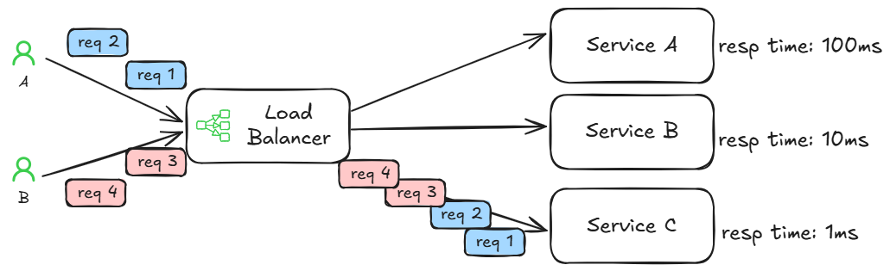
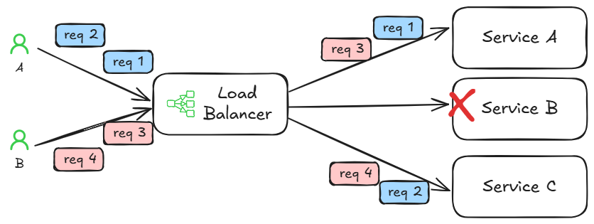

# Load Balancing

## Round Robin

Distributes requests sequentially across the group of servers, one by one. Simple and predictable.

## Weighted Round Robin

Servers with higher capacity (weight) receive a proportionally larger number of requests. Here, Server A gets more traffic.

## Least Connections

Directs new requests to the server with the fewest active connections. The numbers simulate the current connection count.

## IP Hash

The client's IP address is used to determine which server receives the request. This ensures a user consistently connects to the same server.

## Least Response Time

Sends requests to the server that is currently responding the fastest (lowest latency). Server C is consistently the fastest here.

## Adaptive (Health Check)

Distributes traffic based on various server health metrics. Here, Server B periodically fails and the load balancer redirects traffic away from it.

